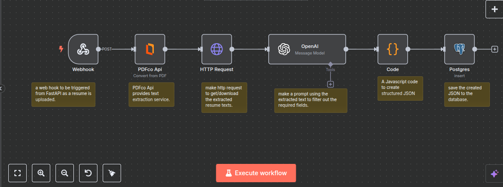

# 📄 Resume Analyzer Automation System
This project automates resume data extraction powered by **OpenAI**. It uses **n8n** for automation workflows, **FastAPI** for backend logic, and **PostgreSQL** as the main database. When a resume is uploaded, the system extracts relevant data (like name, contact, and experience) from the PDF and saves it to the database.

Here is the n8n workflow 

# 🐳 Docker Setup
## 📦 Prerequisites
- **Docker**
- **Docker Compose**

- **.env file with the following environment variables:**

<pre>
JWT_SECRET_KEY=your_jwt_secret_key
POSTGRES_USER=your_postgres_user
POSTGRES_PASSWORD=your_postgres_password
POSTGRES_DB=your_database_name
CLOUDINARY_CLOUD_NAME=your_cloudinary_cloud_name
CLOUDINARY_API_KEY=your_cloudinary_api_key
CLOUDINARY_API_SECRET=your_cloudinary_api_secret_key

</pre>

# ▶️ Running the Project
### 1. Clone the repository:

<pre>
git clone https://github.com/Leta-Asefa/Resume_Analyzer
cd  Resume_Analyzer
</pre>
### 2. Create a .env file in the root directory:

<pre>
JWT_SECRET_KEY=your_jwt_secret_key
POSTGRES_USER=your_postgres_user
POSTGRES_PASSWORD=your_postgres_password
POSTGRES_DB=your_database_name
CLOUDINARY_CLOUD_NAME=your_cloudinary_cloud_name
CLOUDINARY_API_KEY=your_cloudinary_api_key
CLOUDINARY_API_SECRET=your_cloudinary_api_secret_key
</pre>
### 3. Start the containers:

<pre>
docker-compose up --build
</pre>

### 4. Access the services:

**n8n Editor UI: http://localhost:5678**

**Resume Analyzer API: http://localhost:8000**

# 📡 Network Configuration
##### All services are connected through a custom Docker network named resume_network, allowing them to communicate securely without exposing internal ports .

